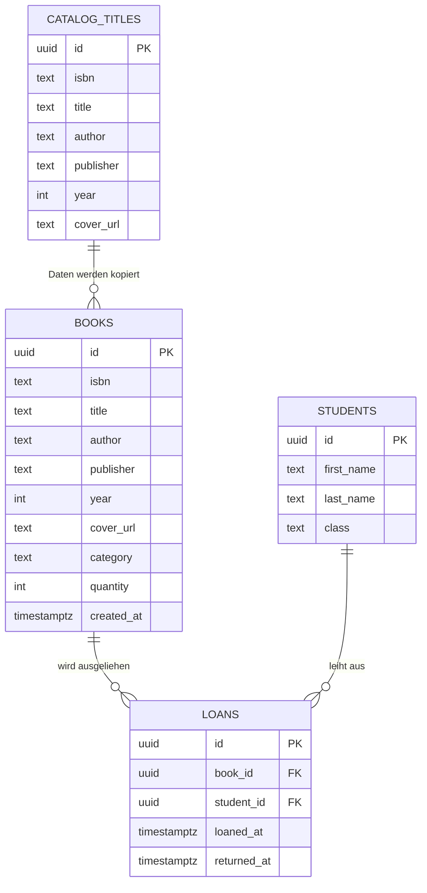

# Schulbibliothek – Inventarsystem

Eine Web-App zur Verwaltung des Buchbestands einer Schulbibliothek. Neue Bücher werden direkt mit der Handykamera per Barcode-Scan erfasst. Die Buchdaten (Titel, Autor, Verlag, Jahr, Cover) kommen dabei automatisch aus einem eigenen Katalog, sodass beim Erfassen fast nichts mehr getippt werden muss. Zusätzlich verwaltet die App Schüler und Ausleihen und zeigt jederzeit, wer welches Buch hat.

> **Status:** in Entwicklung

---

## Inhaltsverzeichnis

1. [Ziel des Projekts](#ziel-des-projekts)
2. [Funktionen im Überblick](#funktionen-im-überblick)
3. [Technologien](#technologien)
4. [Funktionsweise im Detail](#funktionsweise-im-detail)
   - [Katalog-Daten und Scraping](#katalog-daten-und-scraping)
   - [Bücher erfassen per Barcode-Scan](#bücher-erfassen-per-barcode-scan)
   - [Inventarseite](#inventarseite)
   - [Suche](#suche)
   - [Schüler und Ausleihen](#schüler-und-ausleihen)
   - [Dashboard](#dashboard)
5. [Datenbankstruktur](#datenbankstruktur)
6. [Mehrsprachigkeit](#mehrsprachigkeit)
7. [Authentifizierung und Sicherheit](#authentifizierung-und-sicherheit)
8. [Als App auf dem Handy (PWA)](#als-app-auf-dem-handy-pwa)
9. [Installation und lokaler Start](#installation-und-lokaler-start)
10. [Deployment](#deployment)
11. [Geplante Erweiterungen](#geplante-erweiterungen)

---

## Ziel des Projekts

Eine Schulbibliothek mit mehreren tausend Büchern von Hand in eine Tabelle einzutragen ist langsam und fehleranfällig. Dieses Projekt löst das Problem in zwei Schritten:

1. **Katalog als Nachschlagewerk:** Ein großer Katalog mit Buchdaten liegt bereits in der Datenbank.
2. **Erfassung per Scan:** Das Buch wird mit dem Handy gescannt, die App findet es im Katalog und übernimmt die Daten. Es muss nur noch die Anzahl bestätigt werden.

So wird die **erste Erfassung des gesamten Bestands** (First-Time-Input) so einfach und schnell wie möglich.

---

## Funktionen im Überblick

| Bereich | Funktion |
|---|---|
| **Erfassung** | Barcode-Scan (ISBN) mit der Handykamera, Daten werden aus dem Katalog übernommen |
| **Manuelles Hinzufügen** | Wird ein Buch nicht im Katalog gefunden, kann es von Hand angelegt werden |
| **Inventar** | Alle Bücher der Bibliothek mit Cover, Details und Menge |
| **Suche** | Nach Titel, Autor usw. tippen oder per Barcode-Scan suchen |
| **Filter** | Nach Kategorie filtern |
| **Ausleihe** | Ausleihe und Rückgabe eintragen, jederzeit sehen, wer welches Buch hat |
| **Schüler** | Tabelle aller Schüler mit den Büchern, die sie ausgeliehen haben |
| **Dashboard** | Gesamtübersicht, z. B. Gesamtmenge der Bücher |
| **Sprachen** | Albanisch und Englisch, umschaltbar |
| **Zugang** | Nur eingeladene Nutzer, keine offene Registrierung |
| **PWA** | Installierbar auf dem Handy, fühlt sich wie eine native App an |

---

## Technologien

| Bereich | Technologie |
|---|---|
| Framework | Next.js 16 (App Router), React, TypeScript |
| Datenbank und Login | Supabase (PostgreSQL und Supabase Auth) |
| Datenbeschaffung | Python-Skript (Scraping des Buchkatalogs), Import nach PostgreSQL |
| Barcode-Scan | Kamerazugriff im Browser (Handykamera) |
| Hosting | Vercel, Quellcode auf GitHub |
| App-Gefühl | Progressive Web App (PWA) |

---

## Funktionsweise im Detail

### Katalog-Daten und Scraping

Damit Bücher beim Erfassen nicht von Hand eingetippt werden müssen, gibt es einen **Katalog**: eine große Tabelle mit Buchdaten, die als Nachschlagewerk dient.

Die Daten dafür wurden mit einem **Python-Skript** aus einem öffentlich zugänglichen Online-Buchkatalog gesammelt (Scraping). Pro Buch werden diese Informationen erfasst:

- Titel
- Autor
- Verlag
- Erscheinungsjahr
- ISBN
- Cover (als URL zum Bild)

Das Skript speichert alles zunächst als CSV-Datei. Der gesamte Inhalt der CSV wird anschließend in die Tabelle `catalog_titles` in der PostgreSQL-Datenbank importiert.

**Wichtig:** Die Cover werden ausschließlich aus dieser eigenen Katalog-Tabelle geladen (Spalte `cover_url`). Es werden **keine externen ISBN-Dienste** wie Open Library abgefragt. Dadurch bleibt die App unabhängig, schnell und die Daten sind einheitlich.

```
Online-Buchkatalog  →  Python-Skript (Scraping)  →  CSV  →  Import  →  Tabelle catalog_titles
```

### Bücher erfassen per Barcode-Scan

Die Erfassungsseite (`Register`) ist für das Handy gebaut. So läuft die Erfassung ab:

1. Die Kamera öffnet sich, der Barcode (ISBN) des Buchs wird gescannt.
2. Die App sucht die ISBN in der Tabelle `catalog_titles`.
3. **Buch gefunden:** Eine kompakte Vorschau erscheint, ähnlich wie an einer Supermarktkasse, mit **Cover, Titel, Autor und ISBN**. Die Vorschau ist so klein gehalten, dass sie die Kameraansicht nicht verdeckt. Ein Pop-up fragt nach der **Menge** (Anzahl der Exemplare).
4. **Buch nicht gefunden:** Es gibt die Option, das Buch **manuell hinzuzufügen**.
5. Nach dem Bestätigen werden nur die nötigen Felder aus dem Katalog in die Inventar-Tabelle `books` kopiert, dazu kommt die Menge.
6. Alle gescannten Bücher der Sitzung stehen in einer **Seitenleiste**, die von rechts eingeblendet wird. Sie ist standardmäßig versteckt und lässt sich über einen gut sichtbaren Button öffnen. So bleibt die Kamera frei und man behält trotzdem den Überblick.

Die Cover werden groß angezeigt, damit man beim Scannen sofort erkennt, ob das richtige Buch gefunden wurde.

### Inventarseite

Die Inventarseite zeigt alle Titel der Bibliothek aus der Tabelle `books`:

- **Am PC:** übersichtliche Tabelle
- **Am Handy:** Kartenansicht (Grid) mit mittelgroßen Covern und allen Details
- **Angezeigte Daten:** Cover, Titel, Autor, ISBN, Menge und weitere Details
- **Performance:** Es wird nicht alles auf einmal geladen, sondern schrittweise. Das hält die Seite auch bei großen Beständen schnell.
- **Filter:** nach Kategorie

### Suche

Es gibt zwei Wege, ein Buch im Bestand zu finden:

| Suche | Beschreibung |
|---|---|
| **Per Tippen** | Eine Suchleiste für schnelles Suchen, nach Titel, Autor und weiteren Feldern. Sie lädt gezielt nur die Treffer. |
| **Per Barcode** | Das Buch mit der Handykamera scannen, die App zeigt direkt den passenden Eintrag im Bestand. |

### Schüler und Ausleihen

Die App verwaltet, welcher Schüler welches Buch hat:

- **Schülertabelle:** Eine Seite listet alle Schüler. Zu jedem Schüler sieht man die Bücher, die er aktuell ausgeliehen hat.
- **Ausleihe eintragen:** Ein Buch wird einem Schüler zugeordnet. Die Menge der verfügbaren Exemplare sinkt entsprechend.
- **Rückgabe:** Wird ein Buch zurückgegeben, ist das Exemplar wieder verfügbar.
- **Umgekehrte Sicht:** Bei jedem Buch ist erkennbar, wer es gerade hat.

Verfügbare Exemplare = Gesamtmenge im Bestand minus aktuell offene Ausleihen.

### Dashboard

Das Dashboard zeigt die wichtigsten Zahlen auf einen Blick, zum Beispiel die **Gesamtmenge** aller Bücher im Bestand.

---

## Datenbankstruktur

Die Datenbank besteht aus einem **Nachschlagewerk** (Katalog) und dem eigentlichen **Inventar**. Die beiden Teile sind bewusst getrennt:

- `catalog_titles` enthält den **gesamten Inhalt der CSV** und ändert sich im Betrieb nicht.
- `books` enthält nur die Bücher, die tatsächlich in der Bibliothek stehen, zusammen mit Menge und Ausleihe.

Beim Erfassen eines Buchs werden nur die nötigen Felder aus dem Katalog in `books` kopiert.



### Tabellen im Überblick

| Tabelle | Zweck |
|---|---|
| `catalog_titles` | Katalog / Nachschlagewerk. Enthält die gesamten gescrapten Daten (Titel, Autor, Verlag, Jahr, ISBN, `cover_url`). |
| `books` | Inventar. Die tatsächlich vorhandenen Bücher mit Menge und Verknüpfung zur Ausleihe. |
| `students` | Schüler, die Bücher ausleihen dürfen. |
| `loans` | Ausleihen: welches Buch, welcher Schüler, wann ausgeliehen, wann zurückgegeben. Ein Eintrag ohne `returned_at` ist eine offene Ausleihe. |
| `auth.users` | Nutzerkonten der Bibliothekare (von Supabase Auth verwaltet). |

**Vereinfachung bei den Nutzern:** Es gibt aktuell nur eine Rolle und keine eigene `profiles`-Tabelle. Nutzer liegen ausschließlich in `auth.users`.

---

## Mehrsprachigkeit

Die App läuft auf **Albanisch und Englisch**. Die Texte sind **nicht fest im Code** eingebaut, sondern liegen in getrennten Sprachdateien. So kann man später problemlos weitere Sprachen ergänzen oder Texte ändern, ohne die Oberfläche anzufassen.

---

## Authentifizierung und Sicherheit

**Zugang nur per Einladung**
- Es gibt keine offene Registrierung. Nur eingeladene Nutzer kommen in die App.
- Einladungen werden direkt in Supabase (Dashboard) verschickt. Der Nutzer erhält eine E-Mail und setzt auf der Seite `/set-password` sein Passwort.

**Geschützte Seiten und API**
- Alle Seiten außer Login sind nur für angemeldete Nutzer erreichbar.
- Nach dem **Logout** zeigt der Zurück- oder Vorwärts-Button des Browsers keine geschützten Seiten mehr an.
- Die **API-Pfade sind von außen abgesichert** und liefern ohne gültige Anmeldung keine Daten.

---

## Als App auf dem Handy (PWA)

Die gesamte Anwendung ist eine **Progressive Web App**. Sie lässt sich auf dem Startbildschirm des Handys installieren, startet im Vollbild und fühlt sich wie eine native App an. Das ist besonders beim Scannen praktisch, weil die Kamera direkt aus der App heraus genutzt wird.

Das Design ist bewusst schlicht gehalten: **hellgrau und weiß**, mit normalen Icons statt Emojis.

---


